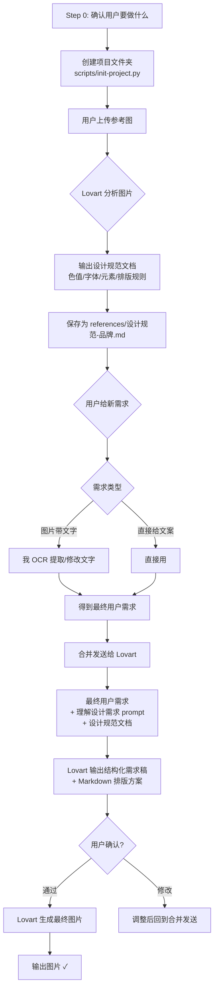

# Lovart 图片设计

> **所有 Lovart 调用统一加 `--mode thinking`**，开启深度推理模式，确保输出质量。

<what-to-do>

## 完整流程



### Step 1：上传参考图 → 建立设计规范

用户上传参考图，**调 Lovart 分析图片，输出设计规范文档**：

```
你：帮我把这些参考图的设计规范提取出来
Lovart：输出【结构化设计规范文档】（含色值、字体、元素、排版规则）
我：保存到 references/设计规范-{品牌}.md
```

设计规范文档是一次建立、反复复用的。同系列海报只需建一次。

### Step 2：处理用户需求（预处理）

用户给出需求后，先判断是否需要预处理：

| 场景 | 处理方式 |
|------|---------|
| 用户上传了带文字的参考图 | 我直接提取/修改图中的文字，生成最终文案 |
| 用户直接给了文案 | 不需要预处理，直接用 |
| 用户说"改一下第X行的文字" | 我直接修改对应文案 |

预处理**不需要调 Lovart**，我做更快。处理完后得到**最终用户需求**。

### Step 3：确认 → 发给 Lovart

**发给 Lovart 前先给用户预览最终要发送的内容，确认无误再发**：

```
发给 Lovart 的消息预览：
━━━━━━━━━━━━━━━━━━━━━━━━━━━━━━━━━━━
【用户需求】
{Step 2 处理后的最终文案}

【理解设计需求】
{references/理解设计需求.md 的核心指令}

【设计规范文档】
{Step 1 保存的设计规范摘要}
━━━━━━━━━━━━━━━━━━━━━━━━━━━━━━━━━━━
以上内容确认无误？确认后发给 Lovart。
```

用户确认后，**将 3 块内容转为纯文本**（Lovart 不支持 Markdown 格式），合并发送：

```
最终发给 Lovart 的消息（纯文本）=
  【用户需求】{Step 2 处理后的最终文案}       ← 最重要，放最前面
  + 【理解设计需求】{references/理解设计需求.md 转纯文本}
  + 【设计规范文档】{Step 1 保存的设计规范 转纯文本}
```

Lovart 按「理解设计需求」prompt 的格式输出：结构化需求稿 + Markdown 排版方案。

### Step 4：核对规范 → 出图

用户确认排版方案后，调 Lovart 生成最终图片。
同系列后续海报：**跳过 Step 1，直接走 Step 2 + Step 3**，每次复用同一份设计规范。

## 批量模式

同一设计规范下需要多张图时（如同一活动的多张海报），先批量处理文案再批量出图：

```
同系列 N 张海报需求
        ↓
Step 2 批量：逐条处理文案（OCR/提取/修改）
        ↓
Step 3 批量：逐条确认预览
        ↓
全部确认后 → 逐条发给 Lovart 出图（或一次性传多个 prompt）
```

## 关键原则

| 不变（设计规范） | 可变（每次不同） |
|:---|:---|
| 背景色、渐变方向 | 文案内容 |
| 设计元素（花瓣/丝带/气泡等） | 排版布局 |
| 品牌色值 | 文字大小 |
| 字体规范 | 信息层级 |
| 整体风格调性 | 产品图/素材图 |

- 设计规范是独立文件，和「理解设计需求」prompt 是两回事
- 规范建好后放 `references/设计规范-{品牌}.md`，下次直接复用

## 目录结构

```
G:\AgentSpace\1_Active\
├── 26-07-图片-HKH618活动/    ← 项目文件夹：年份-月份-类型-任务名
│   ├── 设计规范/
│   │   └── 设计规范-HKH618.md
│   ├── 参考图/               ← 原始参考图片
│   ├── 原始素材/             ← Excel / TXT / PDF 等原始输入
│   │   ├── 文案.xlsx
│   │   ├── 活动规则.txt
│   │   └── ...
│   ├── 需求/                 ← 预处理后的最终文案
│   │   ├── 定金预售.txt
│   │   └── 倒计时50.txt
│   ├── 输出/                 ← 最终图片
│   │   ├── 定金预售.png
│   │   └── 倒计时50.png
│   └── README.md
│
├── 26-07-视频-HKH广告/       ← 其他项目
└── 25-12-规范-品牌手册/
```

> **项目文件夹命名**：`{年份}-{月份}-{类型}-{任务名}`，如 `26-07-图片-HKH618活动`
> **一键创建**：`python scripts/init-project.py "26-07-图片-HKH618活动"`
> **内部文件**：自己分辨即可，无强制规范
