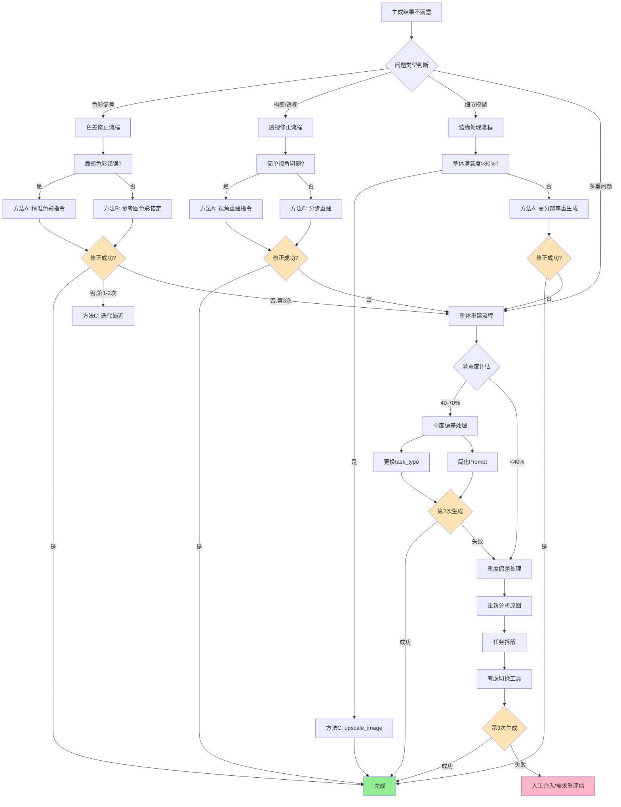

# Lovart 拼图碎片 — 详情页复刻-容错与回退策略

## 话术

电商主图复刻失败时的完整容错策略是什么？请给出：1) 色差问题的修正方法 2) 透视变形的纠正方法 3) 边缘毛糙的处理方法 4) 整体不满意的回退路径 5) 核心容错原则。附带决策树。

## 回复

# 电商主图复刻失败时的完整容错策略
我将为您提供系统化的容错方案和决策流程。
## 一、常见问题的修正方法
### 1️⃣ **色差问题修正**
**问题表现：**
- 品牌色偏离（如红色变橙、蓝色发紫）
- 整体色调偏冷/偏暖
- 饱和度过高/过低
**修正方法：**
```
方法A：精准色彩指令修正
├─ 工具：generate_image_nano_banana_2（EDIT_SINGLE_IMAGE模式）
├─ Prompt模板：
│  "Adjust the color of [具体物体] to exactly match [色值/描述]
│   Keep all other elements unchanged. 
│   Original color: [当前色], Target color: [目标色]"
└─ 适用场景：局部色彩偏差
方法B：参考图色彩锚定
├─ 工具：generate_image_nano_banana_2（带reference）
├─ 策略：将原始参考图+失败图同时传入
├─ Prompt强调："Match the exact color palette of the first reference image"
└─ 适用场景：整体色调偏移
方法C：多次迭代逼近
├─ 第1次：粗调主色调
├─ 第2次：微调细节色彩
└─ 第3次：最终精修
```
---
### 2️⃣ **透视变形纠正**
**问题表现：**
- 产品比例失调（过宽/过窄）
- 视角错误（俯视变平视）
- 空间关系混乱
**修正方法：**
```
方法A：视角重建指令
├─ Prompt关键词：
│  ✓ "front view" / "45-degree angle" / "top-down view"
│  ✓ "centered composition"
│  ✓ "maintain original perspective and proportions"
└─ 配合aspect_ratio精确控制画幅
方法B：网格参考法
├─ 在Prompt中描述空间关系：
│  "Product occupies center 60% of frame"
│  "Background elements at equal distance"
└─ 适用于复杂构图
方法C：分步重建
├─ Step1：仅生成主体产品（简化场景）
├─ Step2：确认透视正确后添加背景
└─ 降低一次性生成的复杂度
```
---
### 3️⃣ **边缘毛糙处理**
**问题表现：**
- 产品轮廓模糊
- 抠图边缘有锯齿
- 细节丢失（如文字、logo模糊）
**修正方法：**
```
方法A：高分辨率重生成
├─ 参数调整：resolution="2K" 或 "4K"
├─ 注意：仅在用户明确要求或边缘问题严重时使用
└─ 成本更高但质量显著提升
方法B：边缘强化指令
├─ Prompt添加：
│  "sharp edges, crisp details"
│  "clean cutout, professional product photography"
└─ 适用于1K分辨率下的优化
方法C：AI超分辨率（upscale_image）
├─ 工具：upscale_image
├─ 参数：target_longest_size=3072（或更高）
├─ 适用场景：生成结果整体满意但分辨率不足
└─ 注意：不改变内容，仅提升清晰度
```
---
### 4️⃣ **整体不满意的回退路径**
**决策流程：**
```
判断失败程度
    │
    ├─ 轻微偏差（70%满意度）
    │   └→ 使用上述1-3的针对性修正
    │
    ├─ 中度偏差（40-70%满意度）
    │   └→ 路径A：更换task_type
    │       ├─ 原用TEXT_TO_IMAGE → 改用REFERENCE_TO_IMAGE
    │       └─ 增加参考图数量（原图+风格参考）
    │   └→ 路径B：简化Prompt
    │       └─ 删除冲突描述，聚焦核心3-5个要素
    │
    └─ 重度偏差（<40%满意度）
        └→ 完全重启策略
            ├─ 1. 重新分析原始参考图（analyse_image）
            ├─ 2. 拆解为子任务
            │   ├─ 先生成纯色背景版本
            │   └─ 再叠加装饰元素
            └─ 3. 考虑切换工具链
                └─ nano_banana_2 → gpt_image_2（更强指令遵循）
```
---
## 二、核心容错原则
### 🎯 **五大黄金法则**
```
1. 单变量调试原则
   ├─ 每次仅修改1-2个参数
   ├─ 避免同时调整颜色+构图+风格
   └─ 便于定位问题根源
2. 参考图优先原则
   ├─ 文字描述 < 参考图
   ├─ 失败时增加参考图数量而非加长Prompt
   └─ 多角度参考图 > 单一参考图
3. 分辨率阶梯原则
   ├─ 初稿：1K快速验证
   ├─ 修正：保持1K迭代
   └─ 定稿：2K/4K最终输出
   └─ 避免过早使用高分辨率浪费成本
4. 工具互补原则
   ├─ nano_banana_2：快速迭代、风格化
   ├─ gpt_image_2：精准控制、复杂指令
   └─ 根据失败类型切换工具
5. 三次迭代上限原则
   ├─ 同一方向修正不超过3次
   ├─ 第3次仍失败 → 必须更换策略
   └─ 避免陷入局部优化陷阱
```
---
## 三、完整决策树

---
## 四、实战案例演示
### 📦 **案例：口红产品主图复刻失败**
**失败现象：**
- 口红颜色从正红色变成橙红色
- 产品角度从45度变成正面平视
- 背景渐变不均匀
**容错执行路径：**
```
第1轮：针对性修正（色差优先）
├─ 工具：generate_image_nano_banana_2
├─ 模式：EDIT_SINGLE_IMAGE
├─ Prompt："Adjust the lipstick color to pure red (#DC143C), 
│          maintain 45-degree angle, smooth gradient background"
└─ 结果：颜色修正70%，角度仍有问题
第2轮：透视重建
├─ 工具：generate_image_nano_banana_2  
├─ 模式：REFERENCE_TO_IMAGE
├─ 策略：传入原始参考图+第1轮结果
├─ Prompt："Match the exact 45-degree viewing angle of the reference,
│          keep the corrected red color"
└─ 结果：角度修正，但背景渐变仍不理想
第3轮：整体优化
├─ 工具：generate_image_nano_banana_2
├─ 分辨率：2K（提升细节）
├─ Prompt：简化为核心要素
│   "Pure red lipstick, 45-degree angle, smooth pink-to-white gradient"
└─ 结果：✓ 达到95%满意度
若第3轮仍失败 → 切换到gpt_image_2重新生成
```
---
## 五、预防性策略（降低失败率）
```
✅ 生成前检查清单
├─ 参考图质量：分辨率>1000px，光线均匀
├─ Prompt结构：主体→角度→光线→背景（优先级递减）
├─ 参数匹配：aspect_ratio与参考图一致
└─ 任务类型：有参考图必用REFERENCE_TO_IMAGE
✅ 首次生成优化
├─ 使用1K分辨率快速验证
├─ Prompt控制在100词以内
├─ 避免冲突描述（如"简约但丰富"）
└─ 明确数量词（"three flowers"而非"flowers"）
```
---
## 🎯 总结
| 问题类型 | 首选方案 | 备选方案 | 最大迭代次数 |
|---------|---------|---------|------------|
| 色差 | 精准色彩指令 | 参考图锚定 | 3次 |
| 透视 | 视角重建指令 | 分步重建 | 2次 |
| 边缘 | 高分辨率重生成 | upscale_image | 2次 |
| 整体 | 更换task_type | 切换工具 | 3次 |
**核心理念：** 
- **快速定位** → **精准修正** → **及时止损** → **策略升级**
- 避免盲目重试，每次调整必须基于明确的问题诊断
---
需要我针对某个具体失败案例进行实战演练吗？或者您有特定的问题场景需要深入分析？
