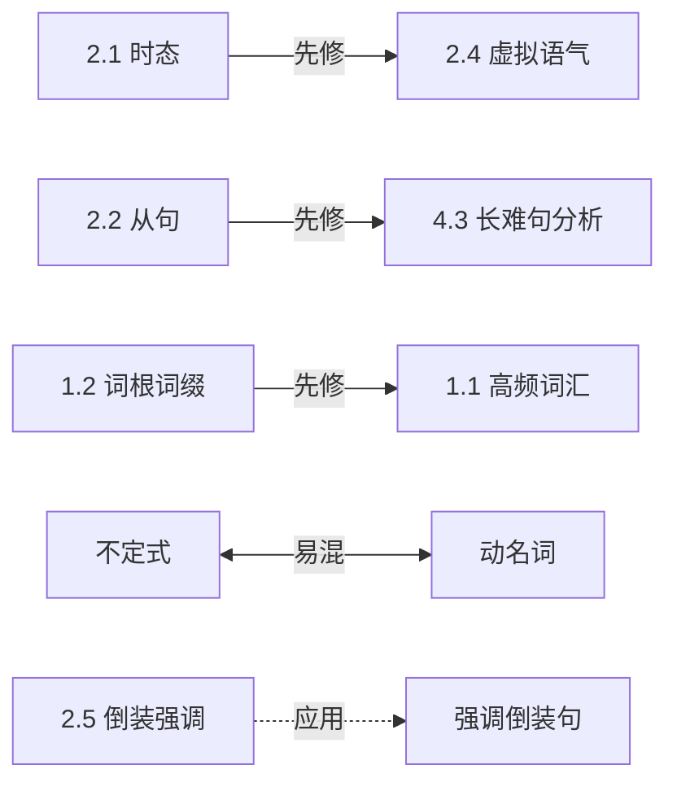

# concept-dependency-taxonomy.md —— 概念依赖关系类型表

> **文档定位**:SKILL.md Step 5(概念依赖挖掘)的**类型枚举 + 判定规则**。
> 当 `preferences.concept_dependency_strategy ∈ {conservative, aggressive}` 时,LLM 按本文档定义的 6 类关系挖掘 framework_tree 节点之间的依赖,产出 `concept_dependencies[]` 写入 `result.json`。
> v0.4 起 `scripts/render_outputs.py` 会把这些依赖渲染成 Mermaid flowchart 箭头。

---

## 1. 6 种依赖关系类型

每条依赖是一条**有向边** `from_node_id → to_node_id`,**6 种 type 互斥**:

| type | 中文名 | 语义 | 学习意涵 | 默认权重 |
|---|---|---|---|---:|
| `prerequisite` | 先修 | A 是学 B 的前置知识 | 先学 A 再学 B | 1.0 |
| `generalization` | 总→分(推广)| A 是 B 的更一般情形 | 先掌握 A 的抽象再看 B 的具体 | 0.7 |
| `specialization` | 分→总(具化)| A 是 B 的特例 | 先理解 A 的特例再上升到 B | 0.7 |
| `contrast` | 对比 / 易混 | A 与 B 表面相似但本质不同 | 一起学,重点比对差异 | 0.6 |
| `application` | 理论→应用 | A 是 B 的方法 / 工具 | 学完 A 后才能做 B | 0.8 |
| `tool` | 主题→工具 | A 是研究 B 的工具 | 工具优先 / 同步学 | 0.5 |

> **不允许**自定义 type;如果某条边不属于以上 6 类,说明语义不清,应**剔除而非新增 type**。

---

## 2. 各类型的判定规则与典型例子

### 2.1 `prerequisite`(先修)

**判定**:学 B 之前必须先理解 A;不学 A 直接学 B 会导致基础崩塌。

**例子**(大学英语 fixture):
- `1.2 词根词缀` → `1.1 高频词汇`(掌握构词法,记词效率提升)
- `2.1 时态` → `2.4 虚拟语气`(虚拟语气的形式建立在时态体系上)
- `2.2 从句` → `4.3 长难句分析`(看懂长难句必须先掌握各类从句)
- `5.2 三段式结构` → `5.1 作文类型`(任何作文类型都套用三段式)

**反例**(非 prerequisite,易混):
- `1.1 高频词汇` ⇏ `4.2 阅读技巧`(高频词只是辅助,不是前置)
- `4.1 题型` ⇏ `4.2 阅读技巧`(两者并行,而非先修)

### 2.2 `generalization`(总→分)

**判定**:A 在概念上覆盖 B,B 是 A 的某种具体形态。

**例子**:
- `2.2 从句` → `2.2.1 名词性从句`(名词性是从句的一类,但更习惯用层级表达,不一定要单独建 generalization 边)
- `5.1.1 议论文` → `5.4.1 校园教育议论文`(议论文是大类)

**何时需要建边**:**跨子树**的总分关系,本来不在父子层级里,但确实是包含关系。
**何时不需要建边**:已经在 framework_tree 中是父子关系——树结构已经表达,不必再画依赖边(除非依赖图独立呈现)。

### 2.3 `specialization`(分→总)

**判定**:A 是 B 的特殊情形,通过抽象 / 推广可以得到 B。

`specialization` 是 `generalization` 的反向边——**禁止同时存在 A→B 的 generalization 和 B→A 的 specialization**(脚本会去重)。

**例子**:
- `2.4.1 if 条件句三类` → `2.4 虚拟语气`(if 三类是虚拟语气的子情形,但更宽的虚拟语气包括 wish / suggest 等)

### 2.4 `contrast`(对比 / 易混)

**判定**:A 与 B 字面相似 / 概念邻近,**学习者常混淆**,需要并列对照学习。

**例子**:
- `1.4.1 affect vs effect`(节点本身已是对比型,但内部两个候选词之间也是 contrast)
- `2.3.1 不定式` ↔ `2.3.2 动名词`(都是非谓语,功能差异)
- `5.1.1 议论文` ↔ `5.1.2 应用文`(写作类型对比)

> contrast 是**对称边**:A↔B 与 B↔A 等价。脚本统一存为 `from < to` 字典序,渲染时双向箭头。

### 2.5 `application`(理论→应用)

**判定**:A 是某种方法 / 思想 / 公式;B 是 A 的具体使用场景。

**例子**:
- `2.5 倒装与强调` → `5.3.1 强调句 / 倒装句`(语法点 → 写作高分句型应用)
- `1.2 词根词缀` → `4.2.4 词义题`(词根知识用于猜词义)

### 2.6 `tool`(主题→工具)

**判定**:B 是研究 / 学习 A 时**配套使用**的工具,但不是 A 的子集,也不是 A 的前置。

**例子**:
- `1.1 高频词汇` → `(外部)Anki 卡片`(在我们 framework 内部用得少,主要 v1.1+ 跨课程图谱用)

> v0.4 阶段的依赖挖掘可以**省略 tool 边**;留给 v1.1 内置课纲库 + 工具链生态时启用。

---

## 3. 依赖边的数据模型

```json
{
  "from": "n2.1",
  "to": "n2.4",
  "type": "prerequisite",
  "weight": 1.0,
  "rationale": "虚拟语气的形式(was/were、had done、would have done)是时态体系的特殊用法,不掌握时态难以理解虚拟形式",
  "evidence_source": "ai_inference",
  "evidence_locator": null
}
```

字段语义:

| 字段 | 类型 | 必填 | 含义 |
|---|---|---|---|
| `from` / `to` | node_id | ✓ | framework_tree 中真实存在的 node id |
| `type` | enum | ✓ | 6 类之一 |
| `weight` | float | ⨯ | 0-1,缺省按 §1 表的默认权重 |
| `rationale` | string | ✓ | 1-2 句解释,**禁止套话**("两者紧密相关"不算)|
| `evidence_source` | enum | ✓ | 同 provenance-spec.md §1 |
| `evidence_locator` | object / null | ⨯ | 若来自材料,同 provenance-spec.md §2 |

---

## 4. 全局约束

### 4.1 边数上限(SKILL.md 核心原则 3)

```
|edges| ≤ total_nodes × 0.3
```

例:fixture 有 94 节点 → 至多 28 条边。

设计意图:**避免一图全相连退化为噪声**。学习者需要的是"有重点的依赖图",不是"知识所有点都互联"。

### 4.2 禁止环

依赖图必须是 DAG(有向无环图),特别是 prerequisite 边不能成环。

- ❌ `A → B → C → A`
- ✓ `A → B`,`A → C`,`B → C`(允许多前置共指)

scripts 在 v0.4 实装时会做拓扑排序检测;若有环,选择**权重最低的边**移除并标 warning。

### 4.3 反向边互斥

- 同一对节点之间最多一条 prerequisite / generalization / specialization 类型边(`generalization` 与反向 `specialization` 等价,只存一条)
- contrast 是对称的,只存一次(按 node_id 字典序 from < to)
- 一对节点可以**同时**有 prerequisite + contrast(罕见但合理:既是先修又是易混)

---

## 5. conservative vs aggressive 策略差异

`preferences.concept_dependency_strategy` 控制挖掘程度:

| 策略 | 边数目标 | 类型筛选 | 用户场景 |
|---|---|---|---|
| `off` | 0 | — | skim 默认,不挖 |
| `conservative` | ≤ total × 0.15 | 只挖 prerequisite + contrast | 快速预览;只想看关键先修与易混 |
| `aggressive` | ≤ total × 0.30 | 6 类全开 | 深度学习路径规划 / 备考冲刺 |

LLM 在 Step 5 收到 strategy 后,按预算自我节制(用 §1 的权重排序选 top-N)。

---

## 6. Mermaid flowchart 渲染约定

`scripts/render_outputs.py` v0.4+ 将依赖图渲染为 Mermaid:

| type | 箭头风格 | 颜色 | label |
|---|---|---|---|
| `prerequisite` | `-->` 实线粗箭头 | 红 `#f5222d` | "先修" |
| `generalization` | `==>` 双线箭头 | 蓝 `#1890ff` | "总→分" |
| `specialization` | `==>` 反向 | 蓝 `#1890ff` | "分→总" |
| `contrast` | `<-->` 双向虚线 | 紫 `#722ed1` | "易混" |
| `application` | `-.->` 虚线 | 绿 `#52c41a` | "应用" |
| `tool` | `-..->` 长虚线 | 灰 `#8c8c8c` | "工具" |

例(节选自规划版 fixture):



---

## 7. 与 framework_tree 的关系(树 vs 图)

> framework_tree 表达**层级包含**(is-part-of);
> concept_dependencies 表达**逻辑依赖**(needs-knowledge-of)。

- 同一节点在树里只有一个父亲;在依赖图里可有多个 from
- 依赖边可以**跨大模块**(如「2.2 从句」属于"语法",但被「4.3 长难句分析」("阅读")依赖)——这正是依赖图的价值
- 渲染时:树用 markmap / opml,依赖图用 Mermaid flowchart,**两者并存而非替代**

---

## 8. 例子:大学英语 fixture 的依赖图(规划 v0.4 落地)

按 `aggressive` 策略,推荐挖出的 ~20 条边(节选):

```
prerequisite:
  n1.2 (词根词缀)        → n1.1 (高频词汇)
  n2.1 (时态)            → n2.4 (虚拟语气)
  n2.2 (从句)            → n4.3 (长难句分析)
  n5.2 (三段式结构)      → n5.1 (作文类型)
  n6.1 (汉译英技巧)      → n6.2 (中国特色话题)

contrast:
  n1.4.2 adapt           ↔ adopt
  n2.3.1 不定式          ↔ n2.3.2 动名词
  n5.1.1 议论文          ↔ n5.1.2 应用文
  n6.3.1 because of      ↔ n6.3.3 as a result

application:
  n2.5 倒装与强调        → n5.3.1 强调倒装句
  n1.2 词根词缀          → n4.2.4 词义题
  n2.2 从句              → n6.1.3 长句拆分

generalization (跨子树):
  n2.4 虚拟语气          → n2.4.1 if 三类(树内,可省)
```

边数 ~14 条,占 94 × 0.15 ≈ 14,刚好 conservative 下限,aggressive 还有 ~14 边预算可挖深层关联。

---

## 9. LLM 在 Step 5 的产出格式

```json
{
  "concept_dependencies": [
    {
      "from": "n2.1",
      "to": "n2.4",
      "type": "prerequisite",
      "weight": 1.0,
      "rationale": "虚拟语气的形式建立在时态体系上,不掌握时态难以理解 was/were 形式",
      "evidence_source": "ai_inference",
      "evidence_locator": null
    },
    ...
  ]
}
```

`scripts/assemble_result.py` 会把这个数组合并到最终 result.json 的 `concept_dependencies` 字段(目前 v0.2 该字段为 null,v0.4 启用)。
